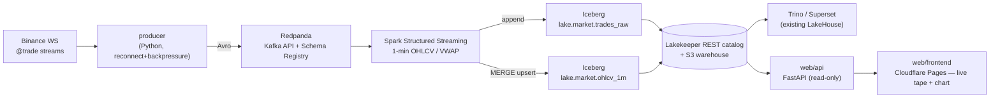

# market-stream

**Live crypto market data → Redpanda → Spark Structured Streaming → Apache Iceberg**, with a
recruiter-facing demo that *never looks broken*. An event-driven streaming pipeline that lands
exactly-once raw ticks and idempotent 1-minute OHLCV/VWAP rollups in the same open lakehouse as
the sibling [`spark-k8s`](../spark-k8s) project — queryable from Trino/Superset and a tiny live
web app.

> 🔴 **Live demo:** _TODO — Cloudflare Pages URL._ The page renders a recorded sample feed with
> zero backend and auto-upgrades to live data whenever the pipeline is running, so it is always
> worth opening.

Binance public WebSocket → a resilient Python producer → Redpanda (Kafka API + Avro Schema
Registry) → a Spark Structured Streaming job → two Iceberg tables in the Lakekeeper REST catalog.

## Architecture



| Layer | Where | What |
|-------|-------|------|
| Contract | `schemas/` | Avro `trade` + `ohlcv` schemas; Redpanda Schema Registry subjects |
| Producer | `producer/` | Binance WS → Redpanda; reconnect/backoff, backpressure, idempotent publish |
| Broker | `ansible/roles/redpanda/` + `local/` | Redpanda (Kafka API + Schema Registry), single broker |
| Streaming | `streaming/` | Spark Structured Streaming → Iceberg; append + MERGE, checkpointed |
| Lakehouse | *reused* | Lakekeeper REST catalog + S3 warehouse from `spark-k8s` (not re-deployed here) |
| Web demo | `web/` | FastAPI read API + static frontend; graceful sample-feed fallback |
| Deploy | `infra/` + `ansible/` | Deploys the workloads onto the **existing** `spark-k8s` cluster |

## Reuses the spark-k8s cluster

market-stream is the **streaming application layer** on top of the platform that
[`spark-k8s`](../spark-k8s) already provides: a kubeadm cluster on Hetzner with the Kubeflow
Spark Operator, a custom Spark+Iceberg image, Lakekeeper (Iceberg REST catalog), Keycloak OAuth2
and an S3 warehouse bucket. This repo does **not** re-provision any of that — it deploys
Redpanda, the streaming `SparkApplication`, and the web API as workloads onto that cluster, and
writes its tables into the existing `lakehouse` warehouse.

Following the spark-k8s convention, **`infra/<cloud>/` is the only cloud-aware layer.** Today it
is thin (a README pointing at the spark-k8s cluster); a future standalone mode would add an
`infra/hetzner/*.tf` that renders the same Ansible inventory contract. `ansible/`, `streaming/`,
`producer/` and `web/` never reference a cloud.

> 📐 Build-time + runtime diagrams: [docs/architecture.md](docs/architecture.md).
> Why Spark over Flink: [docs/spark-vs-flink.md](docs/spark-vs-flink.md).
> Why Binance: [docs/source-choice.md](docs/source-choice.md).

## Quick start — local (recommended)

The laptop stack runs the **whole pipeline** with zero cloud cost: Redpanda + Schema Registry,
MinIO, Lakekeeper, Trino, the producer (pulling **real** live Binance ticks), the Spark job, and
the web API. Requires Docker.

```bash
cp .env.example .env          # dev defaults; nothing secret
make local-up                 # docker compose up --build
# Watch live ticks land in Iceberg, via Trino:
docker exec -it market-stream-trino-1 trino --catalog iceberg \
  --execute "SELECT count(*) FROM market.trades_raw"
# Open the demo against the local API (API is on :8000, so serve the frontend on :8001):
python -m http.server -d web/frontend 8001   # → http://localhost:8001
make local-down               # add ARGS=-v to wipe volumes
```

Verify the rollup is sane:

```sql
SELECT symbol, window_start, open, high, low, close, vwap, trade_count
FROM iceberg.market.ohlcv_1m ORDER BY window_start DESC LIMIT 10;
```

## Quick start — cluster

Assumes the `spark-k8s` cluster is already up (`cd spark-k8s/infra/hetzner && tofu apply` →
`ansible-playbook site.yml`) and you have its `kubeconfig`.

```bash
# 1. Secrets (SOPS + age) — see ansible/secrets/secrets.sops.example.yaml
cd ansible/secrets && cp secrets.sops.example.yaml secrets.sops.yaml
#    fill in real values, then:
sops --encrypt --in-place secrets.sops.yaml
export SOPS_AGE_KEY_FILE=$PWD/../../age.key

# 2. Build + push the images
cd ../.. && make push REGISTRY=ghcr.io/shaked98

# 3. Deploy the workloads onto the cluster
cp /path/to/spark-k8s/ansible/inventory/hosts.ini ansible/inventory/hosts.ini
make deploy
```

This installs Redpanda (Helm), the producer Deployment, the streaming `SparkApplication`
(`restartPolicy: Always`), and the web API + LoadBalancer — all writing into the existing
Lakekeeper `lakehouse` warehouse and S3 bucket.

## Tear down

```bash
make local-down ARGS=-v        # local: stop + wipe volumes
make teardown                  # cluster: remove ONLY market-stream workloads
```

The shared `spark-k8s` cluster is left intact; tear *it* down from that repo (`tofu destroy`).

## Tests

- `tests/validate.sh` — offline: parses every manifest, checks the SOPS secrets file is
  encrypted and the age key isn't tracked, validates the Avro schemas, and runs the Python unit
  tests when `pytest` is present.
- `tests/smoke-test.sh` — live end-to-end: produces N synthetic ticks → waits for a micro-batch
  → asserts rows landed in `market.trades_raw` and a window exists in `ohlcv_1m` (via Trino).
  Runs against the local stack (`make local-smoke`) or the cluster.

See [tests/README.md](tests/README.md).

## Layout

```
schemas/     Avro message contracts (trade.avsc, ohlcv.avsc) + registry conventions
producer/    Binance WS → Redpanda (Python, containerized, pinned deps)
streaming/   Spark Structured Streaming → Iceberg (job + SparkApplication CRD + image)
web/         api/ (FastAPI read-only) + frontend/ (static, Cloudflare Pages)
local/       docker-compose dev stack — the primary verification path
ansible/     shared, cloud-agnostic — roles: secrets, redpanda, streaming, web_api
infra/       infra/<cloud>/ — the only cloud-aware layer (thin: reuses spark-k8s)
docs/        architecture.md, spark-vs-flink.md, source-choice.md
tests/       validate.sh (offline) + smoke-test.sh (live) + unit/
```

## Notes

- **This repo is public — every file is published.** Secrets are never committed: real values
  live in `ansible/secrets/secrets.sops.yaml` (SOPS-encrypted, gitignored) and the age private
  key is supplied out-of-band. Only `secrets.sops.example.yaml` is tracked. The local stack uses
  throwaway dev credentials only.
- **PoC scope.** Single Redpanda broker, single exchange (Binance), 1-minute rollups, no auth on
  the local Lakekeeper. The pipeline itself is production-grade (reconnect, backpressure,
  checkpointing, idempotent Iceberg writes); the web demo is a PoC built to never appear broken.
- **TODO:** confirm the public demo subdomain (`*.pages.dev` vs `market-stream.avrahamshaked.com`)
  and the API host (`api.market-stream.<domain>`); lock CORS to it. Wire the YouTube/portfolio
  link once the demo is published.
