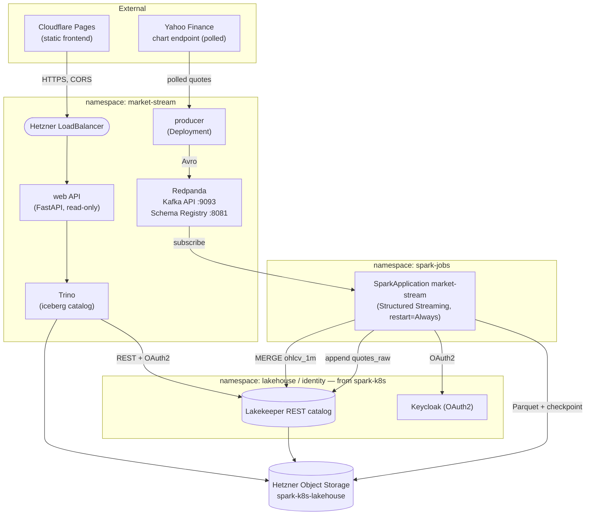
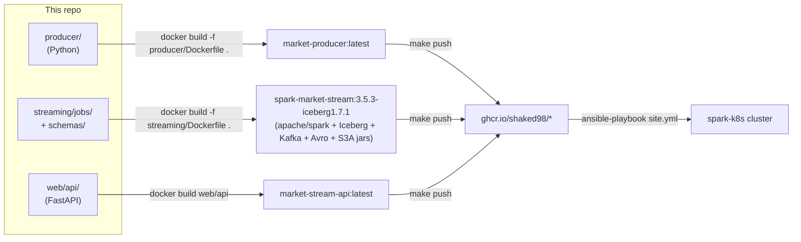

# Architecture

market-stream is the **streaming application layer** on top of the platform the
[`spark-k8s`](../../spark-k8s) repo provisions. It ingests a live market feed, processes it
as a stream, and lands it in the shared Apache Iceberg lakehouse.

## Runtime topology

Two streaming queries share the Kafka topic: a stateless append (`quotes_raw`, exactly-once
via Kafka offsets in the checkpoint + Iceberg's atomic commits) and a stateful, watermarked
1-minute aggregation (`ohlcv_1m`, idempotent upsert via Iceberg `MERGE` on
`(symbol, window_start)`).

## Build-time pipeline

## The cloud seam

Only `infra/<cloud>/` is cloud-aware (and in reuse mode it's just a README pointing at the
spark-k8s cluster). `ansible/`, `producer/`, `streaming/` and `web/` operate on whatever
cluster + Lakekeeper endpoint they're handed — exactly the spark-k8s design. See
[infra/hetzner/README.md](../infra/hetzner/README.md).

## Local vs cluster — the one divergence

| | Local (`local/docker-compose.yml`) | Cluster (`ansible/`) |
|---|---|---|
| Object store | MinIO (`lakehouse` bucket) | Hetzner Object Storage (`spark-k8s-lakehouse`) |
| Catalog auth | none | Keycloak OAuth2 (`OAUTH_ENABLED=true`) |
| Spark | `spark-submit local[2]` | `SparkApplication` (Spark Operator) |
| Checkpoint | `s3a://lakehouse/...` (MinIO) | `s3a://spark-k8s-lakehouse/...` |
| Trino | container | Helm release |

Everything else — catalog name `lake`, warehouse `lakehouse`, table layout, S3FileIO data
path, the transform — is identical, so the local stack is a faithful rehearsal of production.
